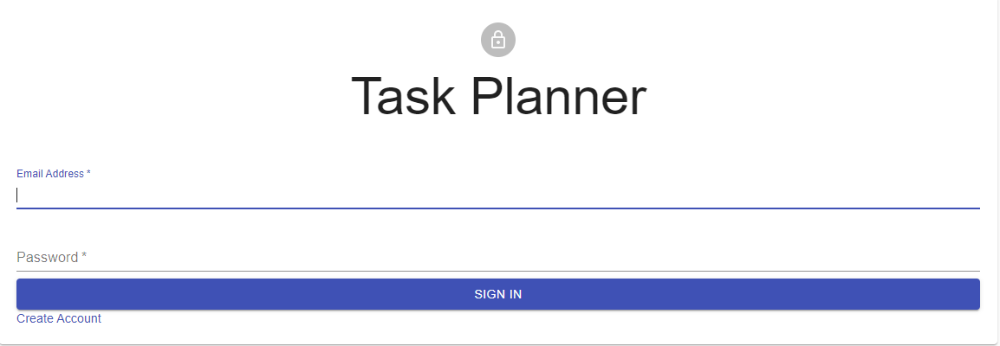
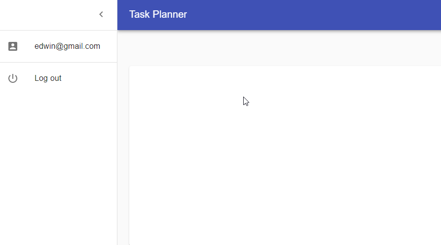
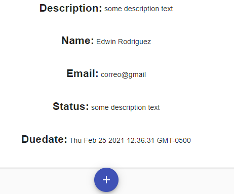

# IETI-Laboratorio-3

## Escuela Colombiana de Ingeniería Julio Garavito

## Edwin Yesid Rodriguez Maldonado

### Create the Login.js component and the CSS if needed (use Material-UI library!)



```
username

edwin@gmail.com

password

prueba123
```

### Create a navigation drawer component with mocked user data



### Create the main view that display the tasks using card layouts



### heroku

[link](https://ieti-laboratorio-3.herokuapp.com/)
